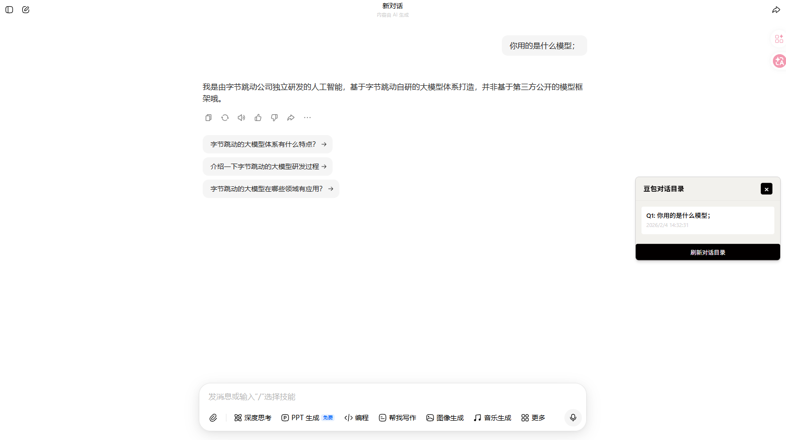

# 豆包对话目录插件

一款专为豆包AI对话设计的浏览器扩展，提供实时对话目录导航功能，实现长对话内容的高效定位。

## 效果展示



## 🎯 功能特点

- **实时目录生成**：自动识别并整理豆包对话中的用户提问，生成清晰的目录列表
- **快速定位**：点击目录项，页面自动滚动到对应的对话位置，并添加高亮效果
- **浮悬框设计**：目录显示在页面右侧，支持拖动到任意位置
- **智能更新**：当对话内容变化时，目录会自动更新
- **美观界面**：采用现代化设计，与豆包页面风格协调
- **性能优化**：使用节流技术，避免频繁更新导致页面卡顿
- **鼠标悬停效果**：目录项支持鼠标悬停效果，提升用户体验
- **选中状态高亮**：点击目录项后会显示选中状态，方便用户识别当前定位的消息

## 📦 安装指南

### 前置要求

- Chrome 88+ / Edge 88+ 浏览器
- 支持 Manifest V3 的浏览器版本
- Node.js 16+ 和 pnpm 包管理器

### 安装步骤

1. **下载插件**

   - 克隆或下载本项目到本地
   - 确保项目文件完整

2. **安装依赖**

   - 打开命令行终端，进入项目目录
   - 执行命令：`pnpm install`

3. **构建插件**

   - 执行命令：`pnpm build`
   - 构建完成后会生成 `build/chrome-mv3` 文件夹

4. **打开浏览器扩展管理页面**

   - Chrome/Edge: 访问 `chrome://extensions/`

5. **启用开发者模式**

   - 点击右上角的"开发者模式"开关

6. **加载插件**

   - 点击"加载已解压的扩展程序"
   - 选择项目目录中的 `build/chrome-mv3` 文件夹
   - 点击"选择文件夹"

7. **验证安装**
   - 访问豆包网站：`https://www.doubao.com/`
   - 观察页面右侧是否出现"豆包对话目录"浮悬框

## 🚀 使用说明

### 基本操作

1. **查看对话目录**

   - 打开豆包对话页面后，插件会自动生成对话目录
   - 目录会显示所有用户发送的对话，每条消息前面有序号

2. **快速定位**

   - 点击目录中的任意一项
   - 页面会平滑滚动到对应的对话位置
   - 目标对话会显示黄色高亮效果，持续2秒
   - 目录项会显示选中状态，方便用户识别

3. **拖动浮悬框**

   - 点击并按住浮悬框的标题栏
   - 拖动到页面任意位置
   - 松开鼠标完成定位

4. **关闭和重新打开**

   - 点击浮悬框右上角的关闭按钮
   - 页面右侧会显示一个小按钮
   - 点击小按钮可以重新打开浮悬框

5. **刷新目录**
   - 点击浮悬框底部的"刷新对话目录"按钮
   - 插件会重新提取对话记录并更新目录

## 🎨 界面风格

- **背景色**：#f2f1ed
- **列表背景色**：#ffffff
- **按钮背景色**：#020000
- **文字颜色**：#020001（主要）、#d2d0d1（次要）
- **高亮颜色**：#fef3c7
- **选中状态颜色**：#f2f7fa

## 🔧 技术实现

- **前端技术**：TypeScript, CSS3
- **扩展框架**：Plasmo
- **UI 技术**：原生 DOM 操作
- **性能优化**：节流技术
- **事件处理**：MutationObserver
- **消息提取**：使用豆包特定的 data-testid 选择器

## 📁 项目结构

```
chatbox-directory-plugin/
├── .github/
│   └── workflows/
│       └── submit.yml       # GitHub Actions 工作流
├── assets/
│   └── icon.png             # 插件图标
├── src/
│   ├── contents/
│   │   └── content.tsx      # 核心内容脚本
│   ├── lib/
│   │   └── utils.ts         # 工具函数
│   └── styles/
│       └── globals.css      # 全局样式
├── build/
│   └── chrome-mv3/          # 构建输出目录
├── .gitignore               # Git 忽略文件
├── .prettierrc.mjs          # Prettier 配置
├── README.md                # 项目说明
├── components.json          # 组件配置
├── package.json             # 项目配置
├── pnpm-lock.yaml           # pnpm 依赖锁定文件
├── popup.tsx                # 弹出页面（预留）
├── tailwind.config.js       # Tailwind CSS 配置
└── tsconfig.json            # TypeScript 配置
```

## 📝 注意事项

1. **权限说明**：插件需要访问豆包网站的内容，以便提取对话记录
2. **隐私安全**：插件所有操作都在本地进行，不上传任何数据
3. **兼容性**：目前仅支持豆包网站 (`https://www.doubao.com/`)
4. **性能影响**：插件使用了节流技术，对页面性能影响极小
5. **消息提取**：插件使用豆包特定的 data-testid 选择器提取消息，确保在不同页面结构下的兼容性

## 🔄 版本更新

### v0.0.1

- ✨ 初始版本发布
- 🎯 实现基本对话目录功能
- 🚀 支持快速定位对话
- 🎨 现代化界面设计
- 🔧 性能优化
- 📱 响应式浮悬框设计

## 🤝 贡献指南

欢迎贡献代码、报告问题或提出建议！

### 开发步骤

1. 克隆仓库到本地
2. 安装依赖：`pnpm install`
3. 开发模式：`pnpm dev`
4. 构建插件：`pnpm build`
5. 测试插件：在浏览器中加载构建后的目录

## 📄 许可证

本项目采用 MIT 许可证。

## 📞 联系我们

如有问题或建议，欢迎通过 GitHub Issues 反馈。

---

**感谢使用豆包对话目录插件！** 🎉
**希望它能为您的豆包使用体验带来便利！** 💪
